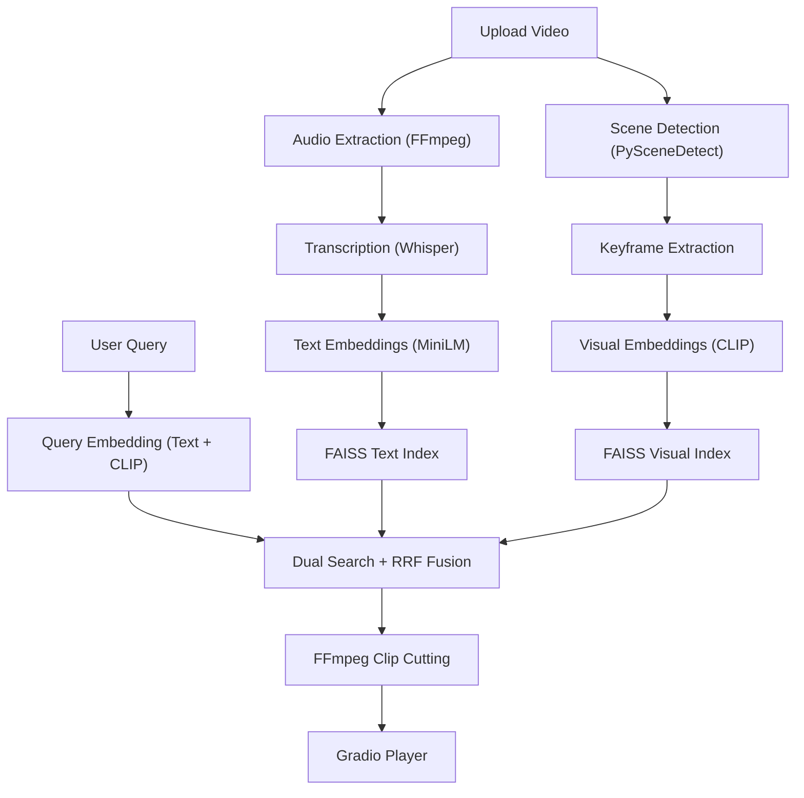

# 🎬 Video-RAG Event Extraction Chatbot

An advanced multimodal Retrieval-Augmented Generation (RAG) system that allows users to upload long-form videos, ask natural language questions about events inside the video, and receive automatically extracted video clips with accurate timestamps.

Built using Python, Gradio, Whisper, CLIP, FAISS, and FFmpeg.

---

## 🚀 Features

- 🎥 Upload long-form videos (1–2 hours)
- 🧠 Multimodal semantic retrieval
  - Transcript-based search
  - Visual scene understanding using CLIP
- ✂️ Automatic clip extraction with timestamps
- 💬 Natural language querying
- 🔍 Dual FAISS vector search with Reciprocal Rank Fusion
- ⚡ Whisper-powered transcription
- 🎞 Scene detection + keyframe extraction
- 🌑 Premium dark-themed Gradio UI
- 📦 Smart caching for already-processed videos

---

## 🏗 Architecture



---

## 🛠 Tech Stack

| Component | Technology |
|---|---|
| UI | Gradio |
| Speech-to-Text | OpenAI Whisper |
| Visual Embeddings | CLIP ViT-B/32 |
| Text Embeddings | all-MiniLM-L6-v2 |
| Vector Database | FAISS |
| Scene Detection | PySceneDetect |
| Video Processing | FFmpeg |
| Backend | Python 3.11 |
| Optional LLM | Google Gemini |

---

## 📁 Project Structure

```bash
RagProject/
├── app.py
├── video_processor.py
├── embedding_engine.py
├── vector_store.py
├── clip_extractor.py
├── query_engine.py
├── utils.py
├── config.json
├── requirements.txt
├── uploads/
├── processed/
└── clips/
```

---

## ⚙️ Installation

### 1. Clone Repository

```bash
git clone https://github.com/erprincechauhan/RAG.git
cd RAG
```

---

### 2. Create Virtual Environment

```bash
python -m venv venv
```

Activate environment:

#### Windows
```bash
venv\Scripts\activate
```

#### Linux / Mac
```bash
source venv/bin/activate
```

---

### 3. Install Dependencies

```bash
pip install -r requirements.txt
```

---

### 4. Install FFmpeg

Download FFmpeg:

https://ffmpeg.org/download.html

OR install via winget:

```bash
winget install ffmpeg
```

Verify installation:

```bash
ffmpeg -version
```

---

## 🔑 Configuration

Add your Gemini API key inside `config.json`:

```json
{
  "gemini_api_key": "YOUR_API_KEY"
}
```

---

## ▶️ Running the Application

```bash
python app.py
```

Open browser:

```text
http://localhost:7860
```

---

## 💡 Example Queries

- "Show me all action scenes"
- "Find the part where they discuss the plan"
- "When does the character first appear?"
- "Show scenes where people are arguing"
- "Find moments involving cars"

---

## 🔄 Processing Pipeline

1. Upload video
2. Scene detection
3. Audio extraction
4. Whisper transcription
5. Keyframe extraction
6. Text + visual embedding generation
7. FAISS indexing
8. Semantic retrieval
9. Automatic clip extraction
10. Return clips in chat interface

---

## 🧠 Key Technical Features

### Dual-Modal Retrieval

Uses both:
- Transcript embeddings
- Visual CLIP embeddings

for higher retrieval accuracy.

### Reciprocal Rank Fusion (RRF)

Combines transcript and visual search results intelligently.

### Smart Video Caching

Already-processed videos are skipped using SHA256 hashing.

### Context-Aware Clip Extraction

- Adds ±3 seconds padding
- Merges overlapping timestamps
- Outputs browser-compatible H.264 clips

---

## 📊 Performance Notes

| Hardware | Estimated Processing Speed |
|---|---|
| CPU Only | Slower for 1–2 hour videos |
| NVIDIA GPU (CUDA) | Significantly faster |

Recommended models:
- CPU → `whisper-base`
- GPU → `whisper-medium` or `large`

---

## ✅ Validation

- ✅ Syntax validation passed
- ✅ All imports verified
- ✅ FAISS indexing working
- ✅ Whisper transcription tested
- ✅ Gradio UI functional
- ✅ FFmpeg integration verified

---

## 🔮 Future Improvements

- Background asynchronous processing
- Multi-video indexing
- Speaker diarization
- Timeline visualization
- Real-time progress tracking
- Cloud deployment support
- Distributed vector database support

---

## 🤝 Contributing

Pull requests and suggestions are welcome.

---

## 📜 License

MIT License

---

## 👨‍💻 Author

Prince Chauhan

GitHub: https://github.com/erprincechauhan
