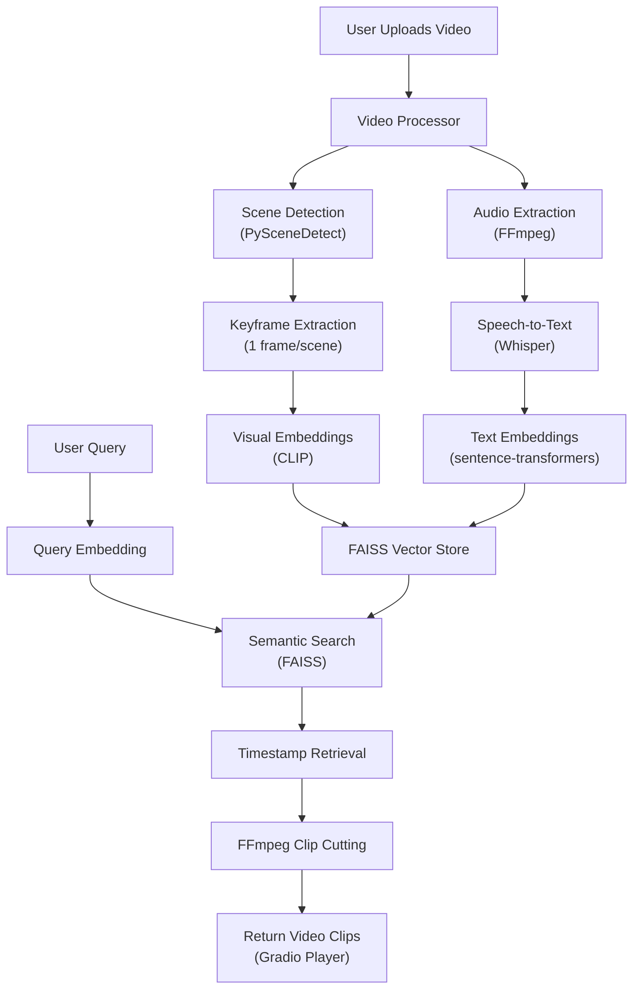

# Video-RAG Event Extraction Chatbot — Implementation Plan

A Video-based Retrieval Augmented Generation (RAG) chatbot that lets users upload long-form videos (1–2 hrs), ask natural language questions about events, and receive **auto-extracted video clips** with precise timestamps.

---

## User Review Required

> [!IMPORTANT]
> **API Key Needed** — This project uses **Google Gemini** (you already have an API key from your Loan Approval project). Confirm you want to reuse the same key, or provide a different one.

> [!IMPORTANT]
> **FFmpeg is NOT installed** on your system. We will need to install it (via `winget` or manual download) before the clip-cutting pipeline works. I'll include this in the setup steps.

> [!WARNING]
> **GPU vs CPU** — Running Whisper and CLIP locally on CPU will be slower for 1–2 hour videos. The plan uses `whisper-base` + `clip-ViT-B-32` for reasonable CPU performance. If you have an NVIDIA GPU with CUDA, we can use larger models.

> [!IMPORTANT]
> **Dual Embedding Strategy Decision** — The plan uses **both** text (transcript) embeddings AND visual (CLIP frame) embeddings for maximum retrieval quality. This means processing takes ~2x as long. Confirm this is acceptable, or we can start with text-only.

---


## Architecture Overview



---

## Tech Stack

| Component | Library | Why |
|---|---|---|
| **UI / Chat** | Gradio 5.x | Native video upload/playback, multimodal chat, zero-config |
| **Scene Detection** | PySceneDetect | Intelligent scene boundary detection with timestamps |
| **Audio Extraction** | FFmpeg (subprocess) | Industry standard, fast |
| **Speech-to-Text** | `openai-whisper` (base model) | Free, local, timestamped segments |
| **Visual Embeddings** | `sentence-transformers` (CLIP ViT-B/32) | Shared text-image embedding space |
| **Text Embeddings** | `sentence-transformers` (all-MiniLM-L6-v2) | Fast, high-quality text embeddings |
| **Vector DB** | FAISS (faiss-cpu) | Fast, in-memory, no server needed |
| **Clip Cutting** | FFmpeg (subprocess) | Precise, fast, keyframe-accurate |
| **LLM (optional)** | Google Gemini | Natural language response generation |
| **Backend** | Python 3.11 | Core logic |

---

## Project Structure

```
RagProject/
├── app.py                    # Main Gradio application + chat interface
├── config.json               # API keys and settings
├── requirements.txt          # All dependencies
├── video_processor.py        # Video ingestion pipeline (scenes, audio, frames)
├── embedding_engine.py       # CLIP + text embedding generation
├── vector_store.py           # FAISS index management (add, search, save/load)
├── clip_extractor.py         # FFmpeg-based clip cutting
├── query_engine.py           # Query processing + semantic retrieval + LLM response
├── utils.py                  # Shared utilities (paths, logging, time formatting)
├── uploads/                  # Uploaded raw videos
├── processed/                # Extracted frames, audio, scene data (per video)
│   └── <video_hash>/
│       ├── audio.wav
│       ├── scenes.json
│       ├── frames/
│       ├── transcript.json
│       └── index.faiss
└── clips/                    # Auto-generated result clips
```

---

## Proposed Changes

### 0. Prerequisites & Setup

#### [NEW] FFmpeg Installation
- Install FFmpeg via `winget install ffmpeg` or download from [ffmpeg.org](https://ffmpeg.org/download.html)
- Required for audio extraction and clip cutting

#### [NEW] [requirements.txt](file:///c:/Users/princ/OneDrive/Documents/RagProject/requirements.txt)
```
gradio>=5.0
openai-whisper
sentence-transformers
faiss-cpu
scenedetect[opencv]
opencv-python-headless
Pillow
numpy
torch
torchaudio
google-genai
```

#### [NEW] [config.json](file:///c:/Users/princ/OneDrive/Documents/RagProject/config.json)
- `gemini_api_key`: For LLM-powered response generation
- `whisper_model`: Model size (default: `base`)
- `clip_model`: CLIP model name (default: `clip-ViT-B-32`)
- `text_model`: Text embedding model (default: `all-MiniLM-L6-v2`)
- `scene_threshold`: PySceneDetect sensitivity (default: `27.0`)
- `max_clip_duration`: Max seconds per result clip (default: `60`)

---

### 1. Utility Module

#### [NEW] [utils.py](file:///c:/Users/princ/OneDrive/Documents/RagProject/utils.py)
- `get_video_hash(path)` — SHA256-based unique ID for each uploaded video
- `ensure_dirs(video_hash)` — Create `processed/<hash>/frames/` structure
- `format_timestamp(seconds)` → `HH:MM:SS`
- `get_ffmpeg_path()` — Locate FFmpeg binary
- Logging configuration

---

### 2. Video Processor

#### [NEW] [video_processor.py](file:///c:/Users/princ/OneDrive/Documents/RagProject/video_processor.py)

**Scene Detection:**
- Use `scenedetect.detect()` with `ContentDetector(threshold=27.0)`
- Extract scene boundaries as `[(start_sec, end_sec), ...]`
- Save to `processed/<hash>/scenes.json`

**Audio Extraction:**
- Run `ffmpeg -i video.mp4 -ar 16000 -ac 1 -f wav audio.wav`
- 16kHz mono WAV for Whisper compatibility

**Keyframe Extraction:**
- For each detected scene, extract 1 representative frame at the midpoint
- Save as `processed/<hash>/frames/frame_XXXX.jpg`
- Store metadata: `{frame_path, scene_idx, timestamp_sec}`

**Whisper Transcription:**
- Load `whisper.load_model("base")`
- Transcribe with `word_timestamps=True`
- Chunk transcript into segments aligned with scene boundaries
- Each chunk: `{text, start_sec, end_sec, scene_idx}`
- Save to `processed/<hash>/transcript.json`

**Full pipeline function:**
```python
def process_video(video_path: str, progress_callback=None) -> dict:
    """Returns metadata dict with scenes, transcript, frames info."""
```

---

### 3. Embedding Engine

#### [NEW] [embedding_engine.py](file:///c:/Users/princ/OneDrive/Documents/RagProject/embedding_engine.py)

**Text Embeddings:**
- Model: `sentence-transformers/all-MiniLM-L6-v2` (384-dim)
- Embed each transcript chunk's text
- Returns `np.ndarray` of shape `(n_chunks, 384)`

**Visual Embeddings:**
- Model: `sentence-transformers/clip-ViT-B-32` (512-dim)
- Embed each keyframe image
- Returns `np.ndarray` of shape `(n_frames, 512)`

**Query Embedding:**
- Text query → embed with **both** models
- Text embedding for transcript search
- CLIP text embedding for visual search

---

### 4. Vector Store

#### [NEW] [vector_store.py](file:///c:/Users/princ/OneDrive/Documents/RagProject/vector_store.py)

Two FAISS indices per video:
1. **Text index** — `IndexFlatIP` over transcript chunk embeddings
2. **Visual index** — `IndexFlatIP` over CLIP frame embeddings

Key functions:
- `build_index(embeddings)` → FAISS index
- `search(index, query_embedding, top_k=5)` → `[(score, metadata_idx), ...]`
- `save_index(index, path)` / `load_index(path)`
- `combined_search(text_idx, visual_idx, text_query_emb, visual_query_emb, top_k)` — Merge + deduplicate results from both indices using reciprocal rank fusion

Metadata stored as a parallel JSON file mapping index positions → `{start_sec, end_sec, text, frame_path, source_type}`.

---

### 5. Clip Extractor

#### [NEW] [clip_extractor.py](file:///c:/Users/princ/OneDrive/Documents/RagProject/clip_extractor.py)

- `extract_clip(video_path, start_sec, end_sec, output_path)` — FFmpeg subprocess
- Uses `-ss` (seek) before `-i` for fast seeking
- H.264 codec for browser compatibility
- Adds ±3 second padding for context
- Merges overlapping clips into single segments
- Returns list of output clip paths

```python
def extract_clips(video_path: str, timestamps: list[tuple[float, float]], 
                  output_dir: str) -> list[str]:
    """Cut multiple clips, merge overlaps, return file paths."""
```

---

### 6. Query Engine

#### [NEW] [query_engine.py](file:///c:/Users/princ/OneDrive/Documents/RagProject/query_engine.py)

**Search Pipeline:**
1. Embed user query (text + CLIP)
2. Search both FAISS indices
3. Merge results via reciprocal rank fusion
4. Group nearby timestamps (within 10s → merge)
5. Return ranked list of `{start, end, relevance_score, context_text}`

**LLM Response (optional, via Gemini):**
- If API key present: send query + retrieved transcript context to Gemini
- Gemini generates a natural language summary of what was found
- If no key: return structured results only

---

### 7. Main Application (Gradio UI)

#### [NEW] [app.py](file:///c:/Users/princ/OneDrive/Documents/RagProject/app.py)

**Layout (Gradio Blocks):**
```
┌──────────────────────────────────────────────┐
│  🎬 Video-RAG Event Extraction Chatbot       │
├──────────────┬───────────────────────────────┤
│              │                               │
│  Upload      │   Chat Interface              │
│  Video       │   - User types query          │
│  [Drop Zone] │   - Bot responds with text    │
│              │     + video clips             │
│  Processing  │                               │
│  Status Bar  │   [Video Player]              │
│              │   Shows selected clip         │
│              │                               │
│  Video Info  │   Clip Results                │
│  - Duration  │   - Clip 1 (00:12-00:48)     │
│  - Scenes    │   - Clip 2 (00:47-01:36)     │
│  - Status    │   - Clip 3 (01:31-01:55)     │
│              │                               │
└──────────────┴───────────────────────────────┘
```

**Features:**
- `gr.Video()` for upload with file type restriction
- `gr.ChatInterface` (multimodal) for Q&A
- Progress bar during video processing
- Video player for clip playback
- Gallery of result clips with timestamps
- Processing state management (upload → process → ready)

**Flow:**
1. User uploads video → triggers `process_video()` pipeline
2. Progress bar shows: scene detection → transcription → embedding → indexing
3. Once ready, chat is enabled
4. User types query → `query_engine.search()` → clips extracted → displayed in chat

---

## Open Questions

> [!IMPORTANT]
> **GPU availability?** Do you have an NVIDIA GPU with CUDA? This significantly impacts model choices:
> - **With GPU**: Can use `whisper-medium/large`, `clip-ViT-L/14` for better accuracy
> - **CPU only**: Stick with `whisper-base`, `clip-ViT-B-32` (plan default)

> [!IMPORTANT]
> **Gemini API key reuse?** Confirm you want to reuse the key from your Loan Approval project's `config.json`, or provide a new one. Gemini is used optionally for generating natural language responses around the clips.

> [!WARNING]
> **Video size handling for 1-2 hour videos**: Processing a 2-hour video will take significant time (est. 15–30 min on CPU for transcription alone). Should we:
> - (A) Process synchronously with a progress bar (simpler, user waits)
> - (B) Process in background and notify when ready (more complex)

---

## Verification Plan

### Automated Tests
1. **Unit test each module** with a short sample video (~30 seconds)
2. **End-to-end test**: Upload video → query → verify clips are extracted correctly
3. **Run the Gradio app** locally and test in browser

### Manual Verification
1. Upload a sample video (I'll use a short one for testing)
2. Ask queries like "Show me all scenes with people talking"
3. Verify returned clips match the query
4. Check clip timestamps are accurate (±3 seconds)
5. Verify video playback works in the Gradio player

### Performance Benchmarks
- Process a 5-minute test video end-to-end
- Measure query latency (target: <5 seconds)
- Verify clip accuracy against manual inspection
