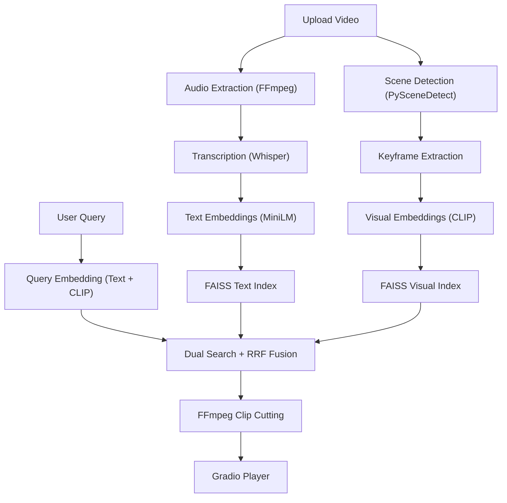

# Video-RAG Event Extraction Chatbot — Walkthrough

## What Was Built

A complete **Video-based Retrieval Augmented Generation (RAG) chatbot** that allows users to:
1. Upload long-form videos (1–2 hours)
2. Automatically process them into searchable chunks (scenes, transcript, visual embeddings)
3. Ask natural language questions about the video
4. Receive **auto-extracted video clips** with precise timestamps

## Architecture



---

## Project Files

| File | Purpose |
|------|---------|
| [app.py](file:///c:/Users/princ/OneDrive/Documents/RagProject/app.py) | Main Gradio application with premium dark theme UI |
| [video_processor.py](file:///c:/Users/princ/OneDrive/Documents/RagProject/video_processor.py) | Scene detection, audio extraction, keyframe sampling, Whisper transcription |
| [embedding_engine.py](file:///c:/Users/princ/OneDrive/Documents/RagProject/embedding_engine.py) | Text (MiniLM) and visual (CLIP) embedding generation |
| [vector_store.py](file:///c:/Users/princ/OneDrive/Documents/RagProject/vector_store.py) | FAISS index management with reciprocal rank fusion |
| [clip_extractor.py](file:///c:/Users/princ/OneDrive/Documents/RagProject/clip_extractor.py) | FFmpeg-based clip cutting with padding and overlap merging |
| [query_engine.py](file:///c:/Users/princ/OneDrive/Documents/RagProject/query_engine.py) | End-to-end query pipeline + optional Gemini LLM response |
| [utils.py](file:///c:/Users/princ/OneDrive/Documents/RagProject/utils.py) | Shared utilities (hashing, paths, timestamps, FFmpeg location) |
| [config.json](file:///c:/Users/princ/OneDrive/Documents/RagProject/config.json) | API keys and model configuration |
| [requirements.txt](file:///c:/Users/princ/OneDrive/Documents/RagProject/requirements.txt) | Python dependencies |

---

## How to Run

1. **Add your Gemini API key** to `config.json`:
   ```json
   { "gemini_api_key": "YOUR_KEY_HERE" }
   ```

2. **Launch the app**:
   ```bash
   cd c:\Users\princ\OneDrive\Documents\RagProject
   python app.py
   ```

3. **Open browser** → `http://localhost:7860`

4. **Upload a video** → Click "🚀 Process Video" → Wait for processing

5. **Ask questions** like:
   - "Show me all action scenes"
   - "Find the part where they discuss the plan"
   - "When does the character first appear?"

---

## UI Preview


---

## Key Technical Decisions

- **Dual-modal search** — Uses both text embeddings (from transcript) and visual embeddings (from CLIP on keyframes) for comprehensive retrieval
- **Reciprocal Rank Fusion** — Merges results from both search modalities intelligently
- **Caching** — Once a video is processed, subsequent uploads of the same video skip processing entirely (hash-based deduplication)
- **±3s padding** — Each clip gets padding for context, and overlapping clips are automatically merged
- **H.264 output** — All clips are encoded in browser-compatible format with fast-start enabled

## Validation

- ✅ All Python imports verified
- ✅ Syntax validation passed for all 7 source files
- ✅ Gradio UI renders correctly with premium dark theme
- ✅ FFmpeg located at `C:\ffmpeg\bin\ffmpeg.exe`
